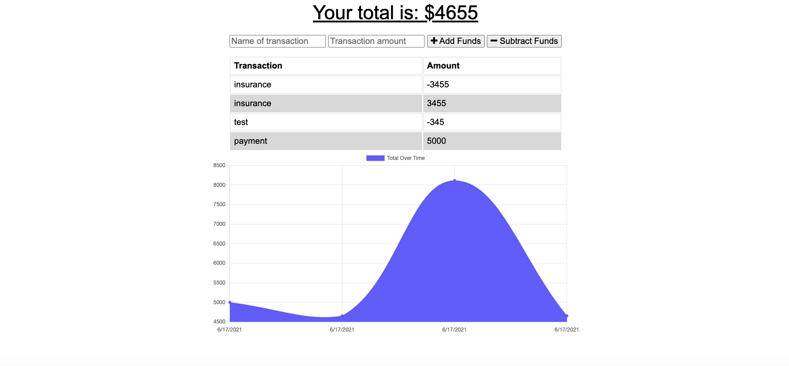

# Budget Tracker

A Budget Tracker application that allows the user to add expenses and deposits to their budget with or without a connection. 
## User Story

```
AS AN avid traveller
I WANT to be able to track my withdrawals and deposits with or without a data/internet connection
SO THAT my account balance is accurate when I am traveling
```

## Screnshot of the app functionality.




## Submission 


  * the URL to the deployed application: https://obscure-woodland-66292.herokuapp.com/

  * the URL to the Github repository: https://github.com/betielbetu/Budget-Tracker

- - -

